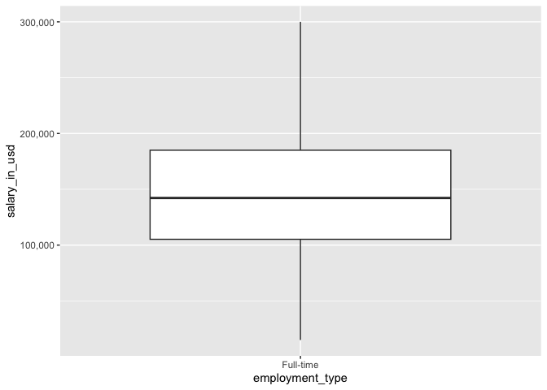
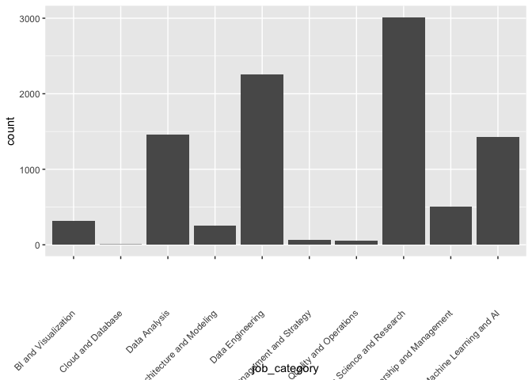

Exploring data science salaries
================
Steven Moran
2024-02-06

``` r
# Load the libraries
library(tidyverse)
```

    ## ── Attaching core tidyverse packages ──────────────────────── tidyverse 2.0.0 ──
    ## ✔ dplyr     1.1.4     ✔ readr     2.1.4
    ## ✔ forcats   1.0.0     ✔ stringr   1.5.1
    ## ✔ ggplot2   3.4.4     ✔ tibble    3.2.1
    ## ✔ lubridate 1.9.3     ✔ tidyr     1.3.0
    ## ✔ purrr     1.0.2     
    ## ── Conflicts ────────────────────────────────────────── tidyverse_conflicts() ──
    ## ✖ dplyr::filter() masks stats::filter()
    ## ✖ dplyr::lag()    masks stats::lag()
    ## ℹ Use the conflicted package (<http://conflicted.r-lib.org/>) to force all conflicts to become errors

# Introduction

In this report we will explore data science salaries. The data come from
Kaggle:

- <https://www.kaggle.com/datasets/ruchi798/data-science-job-salaries>

# Methods

Let’s load the data.

``` r
# Load the CSV file
df <- read_csv('jobs_in_data.csv')

# If you use Excel:
# library(readxl)
# df_excel <- read_excel('jobs_in_data.xls')
```

Let’s get the proportion of work place setting based on country.

``` r
# Create a new table with total number of jobs by country
total_jobs <- df %>% 
  select(employee_residence) %>% 
  group_by(employee_residence) %>% 
  summarize(total_jobs = n())

total_jobs_by_worksetting <- df %>% 
  select(employee_residence, work_setting) %>% 
  group_by(employee_residence, work_setting) %>% 
  summarize(total_jobs_by_worksetting = n())
```

    ## `summarise()` has grouped output by 'employee_residence'. You can override
    ## using the `.groups` argument.

``` r
results <- left_join(total_jobs_by_worksetting, total_jobs)
```

    ## Joining with `by = join_by(employee_residence)`

``` r
# results$proportion <- results$total_jobs_by_worksetting / results$total_jobs

results %>% mutate(proportion = total_jobs_by_worksetting / total_jobs)
```

    ## # A tibble: 145 × 5
    ## # Groups:   employee_residence [83]
    ##    employee_residence work_setting total_jobs_by_workset…¹ total_jobs proportion
    ##    <chr>              <chr>                          <int>      <int>      <dbl>
    ##  1 Algeria            Hybrid                             1          1      1    
    ##  2 American Samoa     Hybrid                             1          1      1    
    ##  3 Andorra            Hybrid                             1          1      1    
    ##  4 Argentina          Remote                             9          9      1    
    ##  5 Armenia            In-person                          1          2      0.5  
    ##  6 Armenia            Remote                             1          2      0.5  
    ##  7 Australia          Hybrid                             4         21      0.190
    ##  8 Australia          In-person                          9         21      0.429
    ##  9 Australia          Remote                             8         21      0.381
    ## 10 Austria            Hybrid                             3          6      0.5  
    ## # ℹ 135 more rows
    ## # ℹ abbreviated name: ¹​total_jobs_by_worksetting

``` r
# Select first 10 objects
# new_table %>% filter(total_jobs > 19)
```

Let’s make a table of just full-time emoployment observations.

``` r
df_only_full_time <- df %>% filter(employment_type == "Full-time")

# If you want to save the table to a new csv file:
# write_csv(df_only_full_time, file='jobs_in_data_full_time.csv')
```

``` r
summary(df_only_full_time)
```

    ##    work_year     job_title         job_category       salary_currency   
    ##  Min.   :2020   Length:9310        Length:9310        Length:9310       
    ##  1st Qu.:2023   Class :character   Class :character   Class :character  
    ##  Median :2023   Mode  :character   Mode  :character   Mode  :character  
    ##  Mean   :2023                                                           
    ##  3rd Qu.:2023                                                           
    ##  Max.   :2023                                                           
    ##      salary       salary_in_usd    employee_residence experience_level  
    ##  Min.   : 15000   Min.   : 15000   Length:9310        Length:9310       
    ##  1st Qu.:105700   1st Qu.:106500   Class :character   Class :character  
    ##  Median :144000   Median :144000   Mode  :character   Mode  :character  
    ##  Mean   :150222   Mean   :150630                                        
    ##  3rd Qu.:187244   3rd Qu.:187000                                        
    ##  Max.   :450000   Max.   :450000                                        
    ##  employment_type    work_setting       company_location   company_size      
    ##  Length:9310        Length:9310        Length:9310        Length:9310       
    ##  Class :character   Class :character   Class :character   Class :character  
    ##  Mode  :character   Mode  :character   Mode  :character   Mode  :character  
    ##                                                                             
    ##                                                                             
    ## 

``` r
x <- df_only_full_time %>% filter(salary_in_usd < 300001)
```

``` r
# plot(salary_in_usd ~ employment_type, data = df)

library(ggplot2)
library(scales)
```

    ## 
    ## Attaching package: 'scales'

    ## The following object is masked from 'package:purrr':
    ## 
    ##     discard

    ## The following object is masked from 'package:readr':
    ## 
    ##     col_factor

``` r
ggplot(x, aes(x=employment_type, y=salary_in_usd)) + 
  geom_boxplot() + 
  scale_y_continuous(labels = scales::comma)
```

<!-- -->

``` r
summary(x$salary_in_usd)
```

    ##    Min. 1st Qu.  Median    Mean 3rd Qu.    Max. 
    ##   15000  105200  142200  146893  185000  300000

Summary of the data.

``` r
summary(df)
```

    ##    work_year     job_title         job_category       salary_currency   
    ##  Min.   :2020   Length:9355        Length:9355        Length:9355       
    ##  1st Qu.:2023   Class :character   Class :character   Class :character  
    ##  Median :2023   Mode  :character   Mode  :character   Mode  :character  
    ##  Mean   :2023                                                           
    ##  3rd Qu.:2023                                                           
    ##  Max.   :2023                                                           
    ##      salary       salary_in_usd    employee_residence experience_level  
    ##  Min.   : 14000   Min.   : 15000   Length:9355        Length:9355       
    ##  1st Qu.:105200   1st Qu.:105700   Class :character   Class :character  
    ##  Median :143860   Median :143000   Mode  :character   Mode  :character  
    ##  Mean   :149928   Mean   :150300                                        
    ##  3rd Qu.:187000   3rd Qu.:186723                                        
    ##  Max.   :450000   Max.   :450000                                        
    ##  employment_type    work_setting       company_location   company_size      
    ##  Length:9355        Length:9355        Length:9355        Length:9355       
    ##  Class :character   Class :character   Class :character   Class :character  
    ##  Mode  :character   Mode  :character   Mode  :character   Mode  :character  
    ##                                                                             
    ##                                                                             
    ## 

``` r
summary(df$salary_in_usd)
```

    ##    Min. 1st Qu.  Median    Mean 3rd Qu.    Max. 
    ##   15000  105700  143000  150300  186723  450000

``` r
summary(df[,6])
```

    ##  salary_in_usd   
    ##  Min.   : 15000  
    ##  1st Qu.:105700  
    ##  Median :143000  
    ##  Mean   :150300  
    ##  3rd Qu.:186723  
    ##  Max.   :450000

``` r
summary(df %>% select(salary_in_usd))
```

    ##  salary_in_usd   
    ##  Min.   : 15000  
    ##  1st Qu.:105700  
    ##  Median :143000  
    ##  Mean   :150300  
    ##  3rd Qu.:186723  
    ##  Max.   :450000

Filtering.

``` r
# table(df$employment_type)
x <- df %>% filter(employment_type == "Full-time")
summary(x$salary_in_usd)
```

    ##    Min. 1st Qu.  Median    Mean 3rd Qu.    Max. 
    ##   15000  106500  144000  150630  187000  450000

``` r
df %>% group_by(employee_residence) %>% summarize(median_by_residence = median(salary_in_usd), how_many_employess = n())
```

    ## # A tibble: 83 × 3
    ##    employee_residence     median_by_residence how_many_employess
    ##    <chr>                                <dbl>              <int>
    ##  1 Algeria                            100000                   1
    ##  2 American Samoa                      45555                   1
    ##  3 Andorra                             50745                   1
    ##  4 Argentina                           60000                   9
    ##  5 Armenia                             33500                   2
    ##  6 Australia                          114979                  21
    ##  7 Austria                             68060.                  6
    ##  8 Belgium                             83398.                  6
    ##  9 Bolivia                             75000                   2
    ## 10 Bosnia and Herzegovina             120000                   1
    ## # ℹ 73 more rows

On x-axis `job_category` and the y-axis `salary_in_usd`.

``` r
table(df$job_category)
```

    ## 
    ##           BI and Visualization             Cloud and Database 
    ##                            313                              5 
    ##                  Data Analysis Data Architecture and Modeling 
    ##                           1457                            259 
    ##               Data Engineering   Data Management and Strategy 
    ##                           2260                             61 
    ##    Data Quality and Operations      Data Science and Research 
    ##                             55                           3014 
    ##      Leadership and Management        Machine Learning and AI 
    ##                            503                           1428

``` r
# Graph it

# library
library(ggplot2)
 
# basic histogram
ggplot(df, aes(x=job_category)) + 
  geom_bar() +
  theme(axis.text.x = element_text(angle = 45, vjust = 0.5, hjust=1))
```

<!-- -->

What’s the mean salary of a data scientist.

``` r
mean(df$salary_in_usd)
```

    ## [1] 150299.5

``` r
median(df$salary_in_usd)
```

    ## [1] 143000
