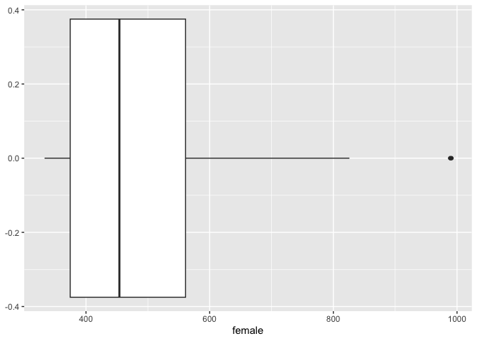
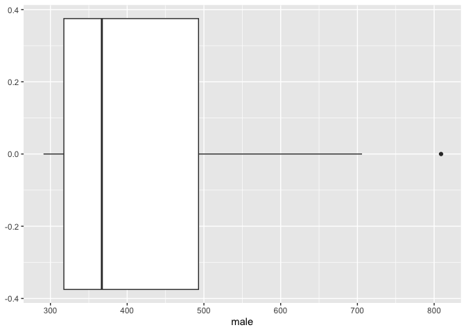
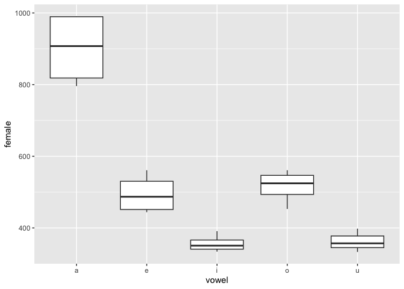
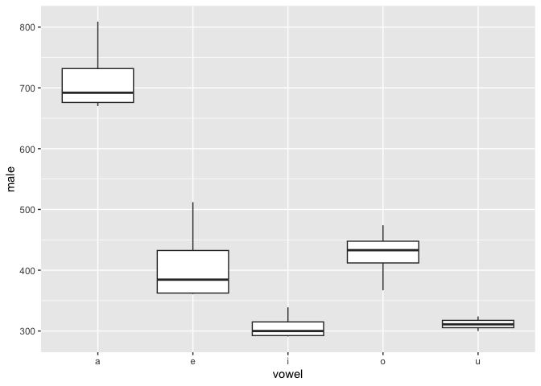
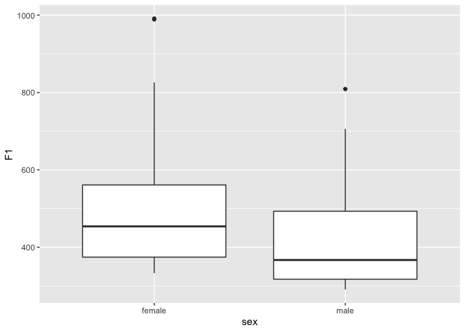
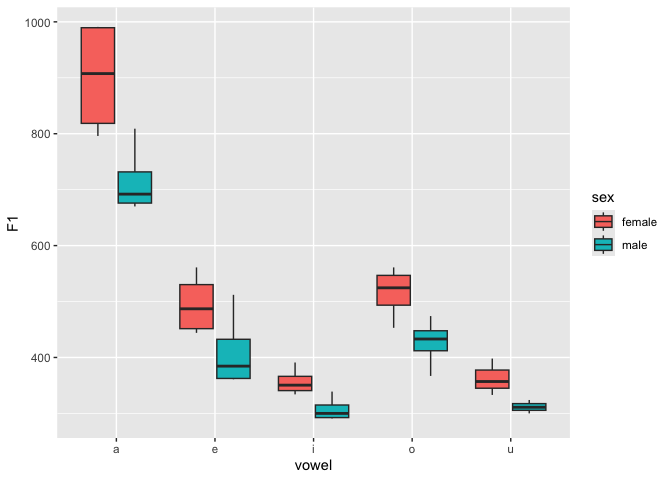

T-test for comparing the means of two groups (based on Johnson (2008))
================
Steve Moran
2022-10-14

``` r
library(tidyverse)
```

    ## ── Attaching core tidyverse packages ──────────────────────── tidyverse 2.0.0 ──
    ## ✔ dplyr     1.1.4     ✔ readr     2.1.4
    ## ✔ forcats   1.0.0     ✔ stringr   1.5.1
    ## ✔ ggplot2   3.5.0     ✔ tibble    3.2.1
    ## ✔ lubridate 1.9.3     ✔ tidyr     1.3.0
    ## ✔ purrr     1.0.2     
    ## ── Conflicts ────────────────────────────────────────── tidyverse_conflicts() ──
    ## ✖ dplyr::filter() masks stats::filter()
    ## ✖ dplyr::lag()    masks stats::lag()
    ## ℹ Use the conflicted package (<http://conflicted.r-lib.org/>) to force all conflicts to become errors

``` r
library(knitr)
```

# Comparing two groups

T-tests are for comparing the means of two groups (e.g., the average
heights of men and women). It is a parametric test based on the
[Student’s T
distribution](https://en.wikipedia.org/wiki/Student%27s_t-distribution).
Essentially, you test the significance of the difference of the mean
values when the sample size is small (i.e, less than 30) and when the
population standard deviation is not available.

Assumptions of this test:

- Population distribution is normal
- Samples are random and independent
- The sample size is small
- Population standard deviation is not known

And recall any hypothesis testing follows these steps:

0.  Choose a significance level (α)
1.  Formulate a null hypothesis, H0
2.  Formulate an alternative hypothesis, H1
3.  Gather data, calculate a test statistic, e.g. T or F
4.  Determine the probability (p-value) of obtaining T or F “or a more
    extreme value” under H0
5.  If p ≤ α, reject H0

And the basic process:

- Set up a hypothesis, and assume that it is true.
- Gather data from some real-world experiment that is relevant to the
  hypothesis.
- Make a determination about the hypothesis, based on the idea of “how
  likely is our data given the hypothesis?”

Let’s go through an example.

------------------------------------------------------------------------

We have some data from @Johnson2008 called `F1_data.txt`. Let’s have a
look:

``` r
f1 <- read_csv('F1_data.csv')
str(f1)
```

    ## spc_tbl_ [19 × 4] (S3: spec_tbl_df/tbl_df/tbl/data.frame)
    ##  $ female  : num [1:19] 391 561 826 453 358 454 991 561 398 334 ...
    ##  $ male    : num [1:19] 339 512 670 427 291 406 706 439 324 307 ...
    ##  $ vowel   : chr [1:19] "i" "e" "a" "o" ...
    ##  $ language: chr [1:19] "W.Apache" "W.Apache" "W.Apache" "W.Apache" ...
    ##  - attr(*, "spec")=
    ##   .. cols(
    ##   ..   female = col_double(),
    ##   ..   male = col_double(),
    ##   ..   vowel = col_character(),
    ##   ..   language = col_character()
    ##   .. )
    ##  - attr(*, "problems")=<externalptr>

``` r
head(f1) %>% kable()
```

| female | male | vowel | language   |
|-------:|-----:|:------|:-----------|
|    391 |  339 | i     | W.Apache   |
|    561 |  512 | e     | W.Apache   |
|    826 |  670 | a     | W.Apache   |
|    453 |  427 | o     | W.Apache   |
|    358 |  291 | i     | CA English |
|    454 |  406 | e     | CA English |

The data include 19 observations from male and female speakers from four
different languages producing different cardinal vowels. For each
observation (row) the variables for the columns (male and female) record
the F1 [formant measures](https://en.wikipedia.org/wiki/Formant) values
in frequency in Hz. Formants are the distinctive properties of vowels in
the acoustic signal in speech. Formants F1-F3 allow us to identify
different [vowels](https://en.wikipedia.org/wiki/Vowel).

Now we want to ask if there is a statistically significant difference
between the F1 values of females versus males. One way we can do this is
by comparing the mean of the two groups.

First we state our hypothesis:

- H0 (null hypothesis): there is no difference between the mean value of
  F1 for females and males
- H1 (alternative hypothesis): there is a difference

Next we identify which statistical test we can use. T-tests compare two
groups. In this case, we have paired data, i.e., each row has an
associated group (male and female), in which the speakers produced the
same vowel. The [paired
t-test](https://en.wikipedia.org/wiki/Student%27s_t-test#Paired_samples)
allows us to test for significance between two paired groups.

Now we [search for examples of how we can do a paired t-test in
R](https://www.google.com/search?q=how+to+do+paired+t+test+in+r) and
figure out what the function is called and which parameters it needs.

``` r
t.test(f1$female, f1$male, paired=T, alternative="greater")
```

    ## 
    ##  Paired t-test
    ## 
    ## data:  f1$female and f1$male
    ## t = 6.1061, df = 18, p-value = 4.538e-06
    ## alternative hypothesis: true mean difference is greater than 0
    ## 95 percent confidence interval:
    ##  67.11652      Inf
    ## sample estimates:
    ## mean difference 
    ##        93.73684

And now we interpret the results and either accept or reject the null
hypothesis.

You may also want to visualize the data!

But is this helpful if we are trying to compare males and females?

``` r
ggplot(data = f1, aes(female)) +
  geom_boxplot()
```

<!-- -->

``` r
ggplot(data = f1, aes(male)) +
  geom_boxplot()
```

<!-- -->

Perhaps a bit more useful?

``` r
ggplot(data = f1, aes(x = vowel, y = female)) +
  geom_boxplot()
```

<!-- -->

``` r
ggplot(data = f1, aes(x = vowel, y = male)) +
  geom_boxplot()
```

<!-- -->

The problem is the input data is not in a format that is particularly
easy to plot as a box plot. So, what do we do? Transform it into a
format that is easy to plot. (Remember, something like 80% of your time
is getting the data in formats that are useful for particular purposes.)

There are many ways to transform the data. Often it helps to first think
about what format you need to get to – I often do this on scrap paper
and then think about the code needed. (Remember with code there’s going
to typically myriad ways of doing the same thing.)

What do we want? We want to be able to group on the male and female
variable – but right now they are in columns.

Here’s a not particularly elegant, but arguably readable way, to
transform the data.

``` r
males <- f1 %>% select(male, vowel, language)
females <- f1 %>% select(female, vowel, language)

males <- males %>% rename(F1 = male)
males$sex <- 'male'
males
```

    ## # A tibble: 19 × 4
    ##       F1 vowel language   sex  
    ##    <dbl> <chr> <chr>      <chr>
    ##  1   339 i     W.Apache   male 
    ##  2   512 e     W.Apache   male 
    ##  3   670 a     W.Apache   male 
    ##  4   427 o     W.Apache   male 
    ##  5   291 i     CA English male 
    ##  6   406 e     CA English male 
    ##  7   706 a     CA English male 
    ##  8   439 o     CA English male 
    ##  9   324 u     CA English male 
    ## 10   307 i     Ndumbea    male 
    ## 11   361 e     Ndumbea    male 
    ## 12   678 a     Ndumbea    male 
    ## 13   474 o     Ndumbea    male 
    ## 14   311 u     Ndumbea    male 
    ## 15   293 i     Sele       male 
    ## 16   363 e     Sele       male 
    ## 17   809 a     Sele       male 
    ## 18   367 o     Sele       male 
    ## 19   300 u     Sele       male

``` r
females <- females %>% rename(F1 = female)
females$sex <- 'female'
females
```

    ## # A tibble: 19 × 4
    ##       F1 vowel language   sex   
    ##    <dbl> <chr> <chr>      <chr> 
    ##  1   391 i     W.Apache   female
    ##  2   561 e     W.Apache   female
    ##  3   826 a     W.Apache   female
    ##  4   453 o     W.Apache   female
    ##  5   358 i     CA English female
    ##  6   454 e     CA English female
    ##  7   991 a     CA English female
    ##  8   561 o     CA English female
    ##  9   398 u     CA English female
    ## 10   334 i     Ndumbea    female
    ## 11   444 e     Ndumbea    female
    ## 12   796 a     Ndumbea    female
    ## 13   542 o     Ndumbea    female
    ## 14   333 u     Ndumbea    female
    ## 15   343 i     Sele       female
    ## 16   520 e     Sele       female
    ## 17   989 a     Sele       female
    ## 18   507 o     Sele       female
    ## 19   357 u     Sele       female

``` r
df <- rbind(females, males)
```

Now we have something a bit easier to work with.

``` r
ggplot(data = df, aes(sex, F1)) +
  geom_boxplot()
```

<!-- -->

And we can be begin to explore the data in various ways.

``` r
ggplot(data = df, aes(vowel, F1, fill=sex)) +
  geom_boxplot()
```

<!-- -->
